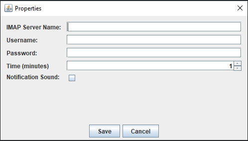
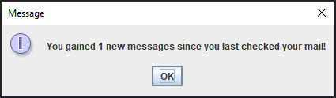
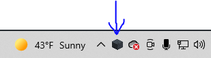
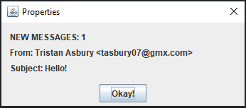

# Email-Notifier  
### Learning Outcomes  
✔️ Learned how to use email protocols  
✔️ Learned how to play a sound in Java  

## The Project  
A program to notify of new emails using IMAP protocol.  
### Upon Startup  
When the user starts the program, the email notifier checks a local directory for a properties file containing email information. If none is found, then the program opens a popup menu:  
</img>  

If the login is successful, the program will check immediately for any new mail. If there exists new mail, a popup will appear:  
</img>  

### While Running  
While the program is running, you will notice a tray icon (a randomly chosen image of a cube)  
</img>  
The user can right-click the tray icon and can do the following:  
- Exit the program  
- Change the program settings  
- Toggle notification sound

If the user receives mail while the program is running, the most recently received mail will show with the sender and subject, along with the number of new messages:  
</img>

